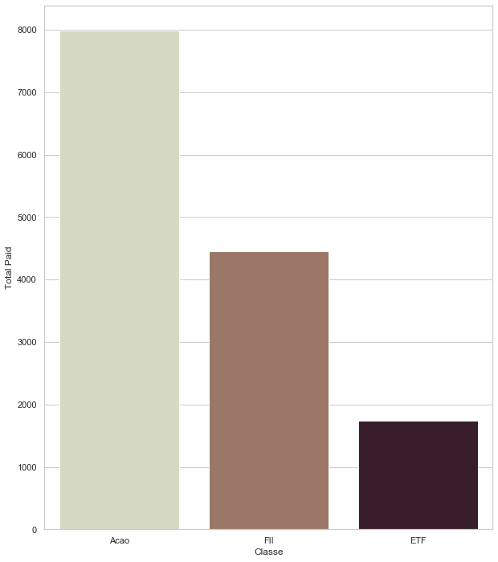
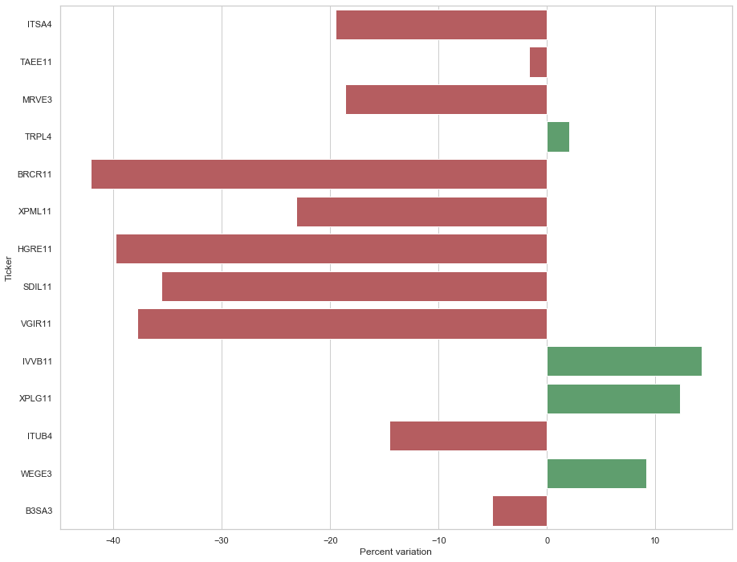

# BR Stocks portifolio analysis 

## Status
Constrindo o modulo  para leitura e escrita no BD integrado com a GUI

## Objetivo
O principal  objetivo do projeto é  conseguir registrar todas as compras e vendas de ativos negociados na  B3, conseguir acompanhar o desempenho da carteira e gerar um relatorio para declaração de Imposto de Renda

## Proximos passos
* Implementar  a  GUI
* Implementar o registro de recebimento de dividendos e juros sobre capital proprio
* Implementar Gerador de Relatorio para imposto de renda
* Implementar Leitura de Notas de Corretora para inclusão de  compra e venda  automática

## Bibliotecas e APIs Utilizados

#### Bibliotecas:
* [Pandas](https://pandas.pydata.org/pandas-docs/stable/user_guide/index.html#user-guide)
* [Matplotlib](https://matplotlib.org/3.1.1/contents.html)
* [Seaborn](https://seaborn.pydata.org/#)
* [MariaDB](https://mariadb.org/documentation/)
* [TKInter](https://docs.python.org/3/library/tk.html)

#### APIs:
* [Marketstack](https://marketstack.com)

### Imagens

